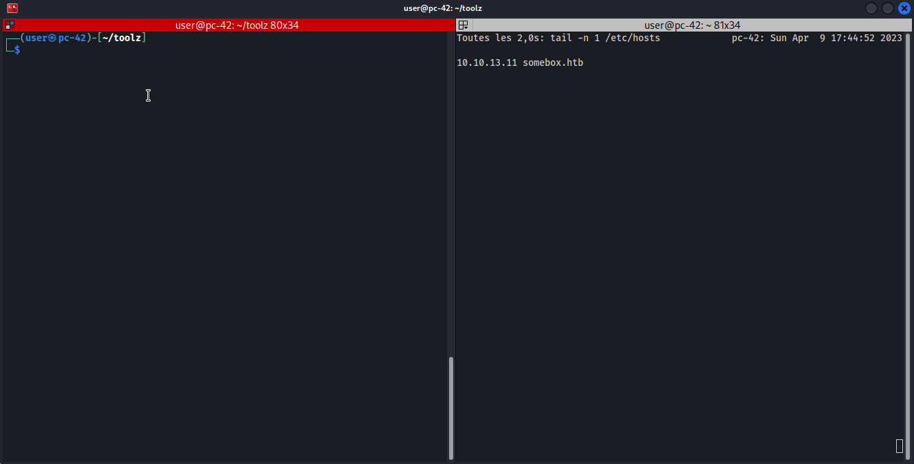

# boxinit.sh
Quickly add a new entry in your /etc/hosts.
I got tired of doing:

> echo "10.10.0.1 box.htb >> /etc/hosts"
or 
> sudo nano /etc/hosts ↓↓↓↓ ctrl+maj+v ctrl+o enter ctrl+x 

so I turned it like:
	
> sudo ./boxinit.sh 10.10.0.1 box.htb

It will append a new line to your /etc/hosts, revolutionnary, isn't it?

# Install
Copy boxinit.sh wherever you store you tools, and make it system-wide accessible by creating a symbolic link to it (set absolute path for the source!) :

	wget https://github.com/narekkay/boxinit.sh/releases/download/release-1/boxinit.sh
	chmod +x boxinit.sh
	sudo ln -s /home/user/toolz/boxinit.sh /usr/bin/boxinit.sh

# Usage
	sudo boxinit.sh <ip> <domain>
	
# Exemple
	sudo boxinit.sh 10.10.14.17 box.htb

# Demo

## Commands

	wget https://github.com/narekkay/boxinit.sh/releases/download/release-1/boxinit.sh
	chmod +x boxinit.sh
	sudo ln -s /home/user/toolz/boxinit.sh/boxinit.sh /usr/bin/boxinit.sh
	sudo boxinit.sh 10.10.14.17 box.htb

# Note
**Only works on UNIX systems.
Not on Windows.**
Steps for Windows :
- **Copy** *C:\Windows\System32\Drivers\etc\hosts* in a writable folder (Desktop for example)
- **Add** your entry in this file
- **Move it again** to its original location and overwriting the current one **(needs admin rights)**
- **Done** 

